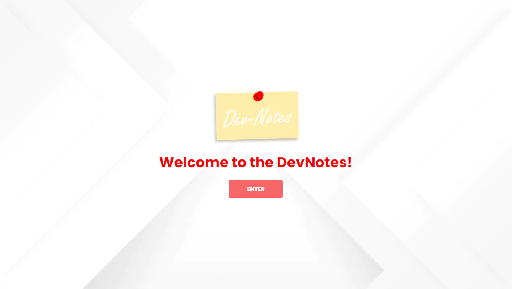
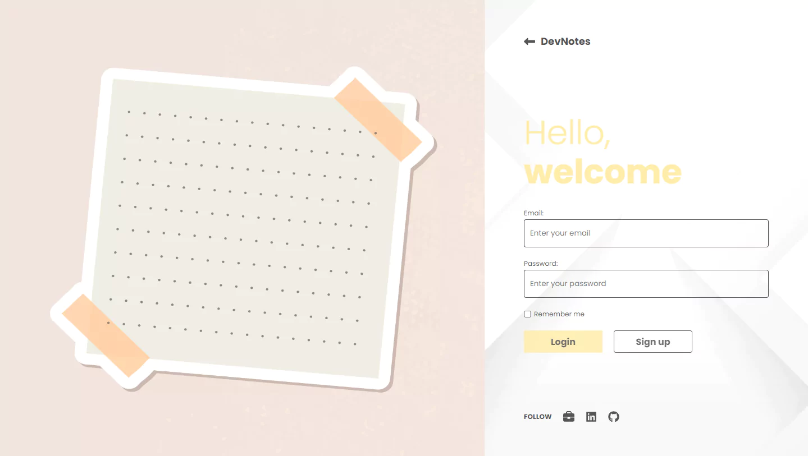
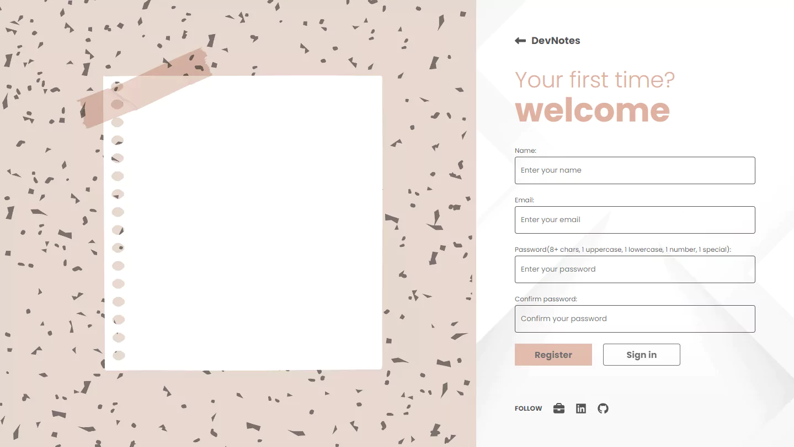
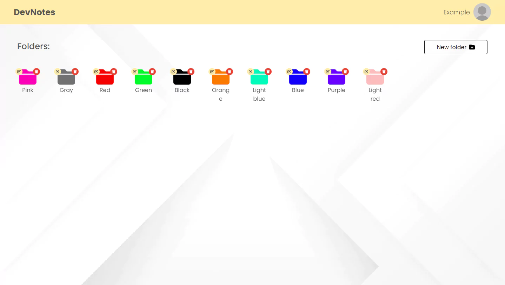
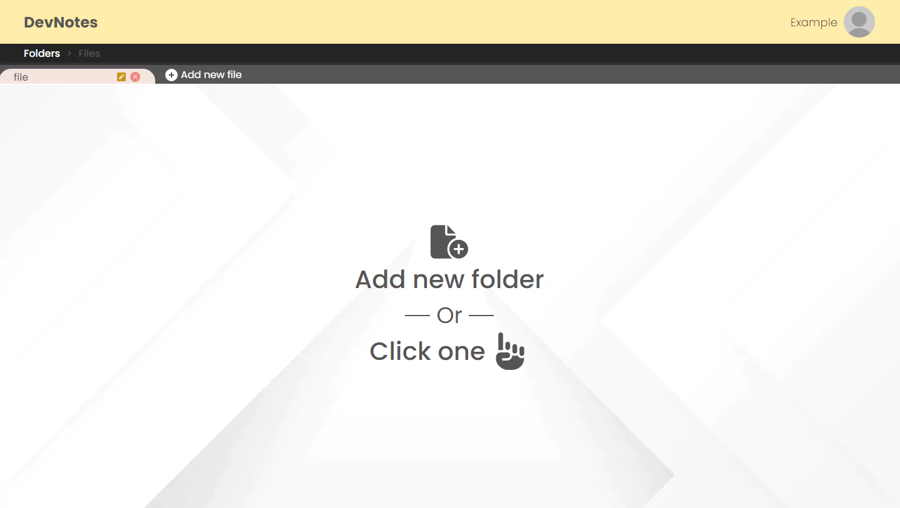
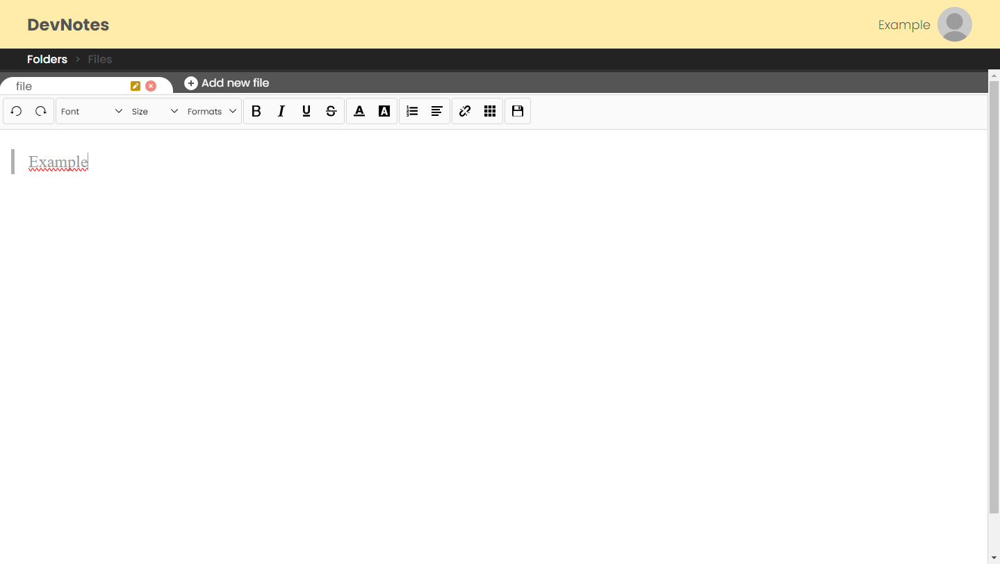
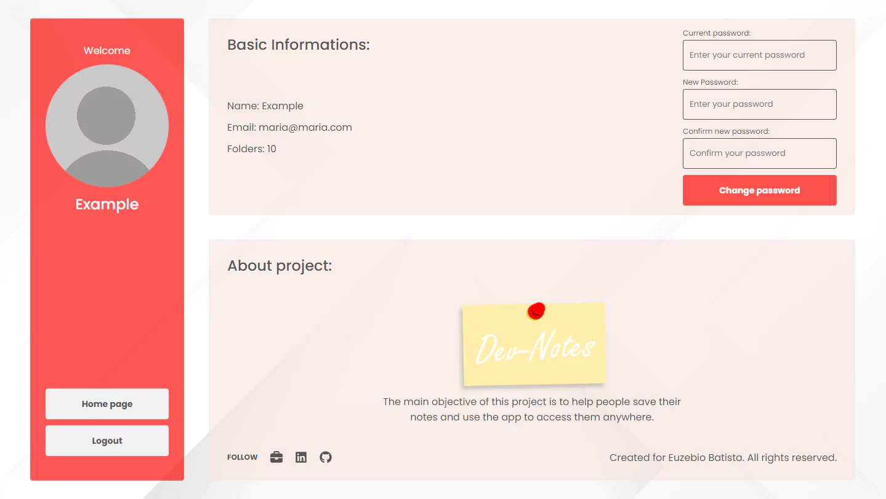

<p align="center"></p>

## About the project:

Project created with the goal of writing notes about commands and reviews.

> The main objective of this project is to help people save their notes and use the app to access them anywhere.

## Resources used:

> Frontend:

- (Build) Vite
- React
- Styled-components
- Axios
- React-router-dom
- Events
- Font-awesome(Icons)
- SunEditor-react

> Backend:

- (Build) MVC
- (Database) MongoDB
- (Dev mode) Nodemon
- Node.js
- Bycrypt
- Cookie-parse
- Cors
- Express
- JsonWebToken
- Mongoose

## Commands:

> Frontend:

```sh
npm npx create vite@latest
npm install
```

> Backend:

```sh
npm install
```

## Running project:

> Frontend:

```sh
npm run dev
```

- http://localhost:5173/

> Backend:

```sh
npm start
```

- http://localhost:5000/

## Project images:









## Updates:

- 1.1.2 - 🐛 Color input
  - Fixed color input.
- 1.1.1 - 🐛 Readme.md
  - Src file.
- 1.1.0 - 📸🐛 Fixed errors and updated documentation
  - Fixed bugs.
  - Snapshots.
- 1.0.10 - 🔧 Front File configurations(vercel.json)
  - Add Vercel.json.
- 1.0.9 - 🔧 File configurations(vercel.json)
  - Vercel.json.
  - Package.json.
- 1.0.8 - 🔧 File configurations(vercel.json)
  - Add Build.
  - Update port.
- 1.0.7 - 🔧 File configurations(vercel.json)
  - Build.
- 1.0.6 - 🐛 Fix style
  - Margin on ragister page.
- 1.0.5 - 🔧 File configurations(vercel.json)
  - Add vercel.json.
- 1.0.4 - 🔧 Update File configurations(package.json)
  - Npm start.
- 1.0.3 - 🔧 File configurations(package.json)
  - Npm start.
- 1.0.2 - 🔧 File configurations
  - Node version.
  - Port.
- 1.0.1 - 📝 Metatags and validations
  - Metatags.
  - Add validations.
- 1.0.0 - ✨ First version
  - Loading page.
  - 404 page.
  - Responsive.
  - Verifications on the creation and editing page.
- 0.3.2 - 📝 Profile page
  - Cretion of profile page.
  - Change password.
  - Logout.
  - Edit file.
- 0.3.1 - 📝 Actions on files page
  - File cache.
  - Update file.
  - Delete file.
- 0.2.1 - 📝 Files page
  - Get all files.
  - Create file.
- 0.2.0 - 📝📦️ Folders page
  - Creation of folders page.
  - Create/Read/Update/Delete folder.
  - Env routes.
  - Nav container.
- 0.1.1 - 📝 authentication via token
  - Creation of the token logistics.
  - Create login function.
  - Starting the dashboard page.
- 0.1.0 - 📝📦️ Register user
  - Creation of the front and back functions in register.
  - Add new lib(font-awesome).
  - Token configs.
- 0.1.0 - 📦️ Project base
  - Creation of the frontend and backend base.
- 0.0.1 - 🎉 Initial project
  - Initial project.

## Additional informations:

Euzebio Batista [@Linkedin](https://www.linkedin.com/in/euzebio-batista) - euzebio.batista2@gmail.com

Created for **Euzebio Batista**.
**All rights reserved.**
